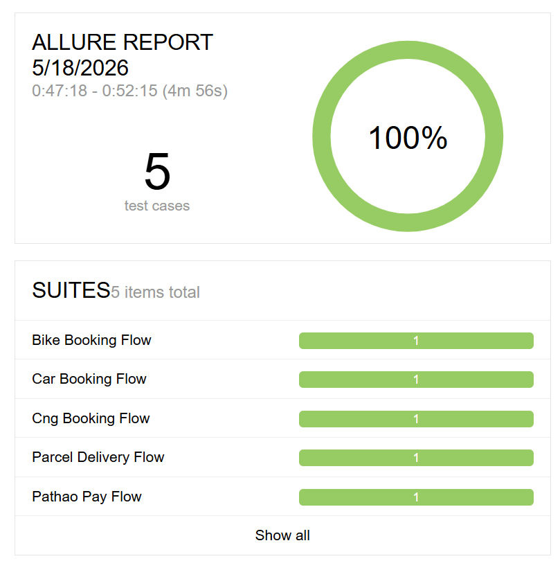
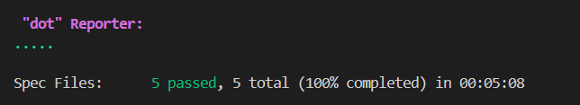

# 🧪 WebDriverIO Pathao Android App Automation

<p align="center">
  
  
  
  
</p>

<p align="center">
  
  
  
  
</p>

A mobile end-to-end automation testing project for the **Pathao Android application** using **WebDriverIO**, **Appium**, and **Mocha**.

This project automates major Pathao app flows including ride booking, parcel delivery, and Pathao Pay MRT recharge. The framework follows the **Page Object Model (POM)** design pattern to keep the test code clean, reusable, and easy to maintain.

---

## Project Overview

This automation framework validates the following Pathao Android app flows:

- Bike booking flow
- Car booking flow
- CNG booking flow
- Parcel delivery flow
- Pathao Pay MRT recharge flow

Each test launches the Pathao app, performs real user like interactions, validates screen navigation, and completes or cancels the flow safely depending on the scenario.

---

## Tech Stack

| Technology | Purpose |
|---|---|
| WebDriverIO | Test automation framework |
| Appium | Mobile automation server |
| UiAutomator2 | Android automation engine |
| Mocha | Test framework |
| Node.js | Runtime environment |
| Allure Report | Test reporting |
| dotenv | Environment variable management |

---

## Project Structure

```txt
WebDriverIo-PathaoApp/
│
├── tests/                               # Contains all test-related files
│   │
│   ├── pageobjects/                     # Page Object Model files with selectors and actions
│   │   │
│   │   ├── forRide/                     # Page objects for Bike, Car, and CNG ride flows
│   │   │   ├── setDestination.page.js  
│   │   │   ├── rideDetails.page.js      
│   │   │   ├── setPickUp.page.js        
│   │   │   └── confirmCancel.page.js    
│   │   │
│   │   ├── forParcel/                   # Page objects for parcel delivery flow
│   │   │   ├── deliveryType.page.js    
│   │   │   ├── setDestination.page.js   
│   │   │   ├── receiversDetails.page.js 
│   │   │   └── cancelRequest.page.js    
│   │   │
│   │   ├── pathaoPay/                   # Page objects for Pathao Pay flow
│   │   │   ├── verification.page.js     
│   │   │   └── dashboard.page.js        # Handles MRT recharge and payment navigation
│   │   │
│   │   └── home.page.js                 # Handles service selection from Pathao home screen
│   │
│   ├── specs/                           # Test specification files
│   │   ├── bike.e2e.js                  
│   │   ├── car.e2e.js                   
│   │   ├── cng.e2e.js                   
│   │   ├── parcel.e2e.js                
│   │   └── pathaoPay.e2e.js             
│   │
│   └── testdata/                        # Test data files
│       └── parcelData.js                # Receiver and parcel information
│
├── utils/                               # Reusable utility functions
│   ├── gestures.js                      # Swipe and tap gesture methods
│   └── helpers.js                       # Common wait, click, scroll, and input helpers
│
├── .env                                 # environment variables
├── .gitignore                           
├── package.json                         # Project scripts and dependencies
├── package-lock.json                    # Locked dependency versions
├── README.md
└── wdio.conf.js                         # WebDriverIO and Appium configuration
```

## Demo Video

Watch the full automation test execution demo:

[Pathao App Automation Demo](https://youtu.be/5DaVmxvw24A)

---

## Test Execution Report

The complete test suite was executed successfully using WebDriverIO, Appium, Mocha, and Allure Report.

```txt
Spec Files: 5 passed, 5 total
Status: 100% Passed
```



### Terminal Execution

The full test suite was also verified from the terminal.




---

## Test Scenarios

### Ride Booking

The ride booking flow is tested for Bike, Car, and CNG services.

Covered steps:

1. Launch Pathao app
2. Select ride service
3. Enter destination
4. Select available ride option
5. Set pickup location
6. Confirm ride request
7. Cancel ride request
8. Validate return to ride details page

Covered files:

```txt
tests/specs/bike.e2e.js
tests/specs/car.e2e.js
tests/specs/cng.e2e.js
```

---

### Parcel Delivery

The parcel flow validates parcel request creation and cancellation.

Covered steps:

1. Launch Pathao app
2. Select Parcel service
3. Select delivery type
4. Enter parcel destination
5. Fill receiver details
6. Fill sender and receiver address details
7. Fill item information
8. Submit request
9. Cancel parcel request

Covered file:

```txt
tests/specs/parcel.e2e.js
```

---

### Pathao Pay MRT Recharge

The Pathao Pay flow validates MRT recharge navigation and payment method selection.

Covered steps:

1. Launch Pathao app
2. Select Pathao Pay
3. Verify user PIN
4. Select MRT Top Up
5. Login with credentials
6. Select MRT recharge card
7. Choose recharge amount
8. Select Mobile Banking
9. Select Pathao Pay
10. Return to MRT dashboard

Covered file:

```txt
tests/specs/pathaoPay.e2e.js
```

> **Note:** Payment-related automation should be handled carefully. Use a test account or stop before making real payments if needed.

---

## Key Features

- End-to-end Android app automation
- Page Object Model (POM) architecture
- Separate specs for each major app flow
- Reusable helper methods
- Reusable mobile gesture utilities
- Dynamic destination input
- Environment based credentials
- Parcel test data management
- Explicit wait handling for slow-loading screens
- Retry logic for unstable screens
- Allure report integration
- Sequential execution on a real Android device

---

## Prerequisites

Before running this project, make sure the following are installed:

- Node.js and npm
- Java JDK
- Android Studio / Android SDK Platform Tools
- Appium
- UiAutomator2 driver
- Allure Commandline
- A real Android device or Android emulator
- Pathao app installed on the device

Check connected Android device:

```bash
adb devices
```

Expected output should show your device ID.

---

## Installation

Clone the repository:

```bash
git clone https://github.com/notAlfy/pathao-appium-mobileAutomation.git
cd pathao-appium-mobileAutomation
```

Install project dependencies:

```bash
npm install
```

This command installs all project dependencies, including WebDriverIO, Mocha, Appium service, dotenv, and Allure reporter.

Install Appium globally if it is not installed:

```bash
npm install -g appium
```

Install UiAutomator2 driver:

```bash
appium driver install uiautomator2
```

Verify Appium installation:

```bash
appium -v
```

---

## Environment Variables

Create a `.env` file in the root directory.

.env example

```env
PATHAO_PAY_PIN=your_pathao_pay_pin
EMAIL=your_email
PASSWORD=your_password

BIKE_DEST=Uttara Diabari
CAR_DEST=Dhanmondi 8
CNG_DEST=Banani Graveyard
PARCEL_DEST=Shantinagar Pir Shaheber Goli
```


---

## WebDriverIO Configuration

The main configuration file is:

```txt
wdio.conf.js
```

Example capability configuration:

```js
capabilities: [{
    platformName: 'Android',
    'appium:deviceName': 'RZCT80PEYEH',
    'appium:platformVersion': '16.0',
    'appium:automationName': 'UiAutomator2',
    'appium:appPackage': 'com.pathao.user',
    'appium:noReset': true,
    'appium:newCommandTimeout': 3600,
    'appium:autoGrantPermissions': true,
    'appium:fullReset': false,
    'appium:autoLaunch': true
}]
```

---

## Running Tests

Run all test files:

```bash
npm run wdio
```

Run a specific test file:

```bash
npm run wdio -- --spec tests/specs/bike.e2e.js
```

```bash
npm run wdio -- --spec tests/specs/car.e2e.js
```

```bash
npm run wdio -- --spec tests/specs/cng.e2e.js
```

```bash
npm run wdio -- --spec tests/specs/parcel.e2e.js
```

```bash
npm run wdio -- --spec tests/specs/pathaoPay.e2e.js
```

---

## Allure Report

This project supports Allure reporting.

Install Allure dependencies:

```bash
npm install --save-dev @wdio/allure-reporter allure-commandline
```

Recommended `package.json` scripts:

```json
"scripts": {
  "test": "wdio run ./wdio.conf.js",
  "wdio": "wdio run ./wdio.conf.js",
  "allure:generate": "allure generate allure-results --clean -o allure-report",
  "allure:open": "allure open allure-report",
  "allure:serve": "allure serve allure-results",
  "test:report": "npm run wdio && npm run allure:generate && npm run allure:open"
}
```

Run tests and generate report:

```bash
npm run test:report
```

Generate report only:

```bash
npm run allure:generate
```

Open generated report:

```bash
npm run allure:open
```

Serve report directly:

```bash
npm run allure:serve
```

---

## Sample Test Result

Example successful execution:

```txt
Spec Files: 5 passed, 5 total
Status: 100% Passed
```

Allure report shows:

- Total test cases
- Passed and failed status
- Test suites
- Execution time
- Test history
- Failure details
- Environment information

---

## Utilities

### `helpers.js`

Contains reusable helper methods for common test actions:

```txt
waitAndClick()
wait()
ensureVisible()
findClickFill()
findAndClick()
hideKeyboardIfVisible()
nativeScrollToText()
```

These methods help reduce duplicate code and improve test stability.

### `gestures.js`

Contains reusable mobile gesture methods:

```txt
bottomSwipeUp()
halfSwipeUp()
tapByCoordinates()
```

These methods are used for scrolling and tapping in screens where normal element interaction is difficult.

---

## Test Data

Parcel receiver data is stored separately in:

```txt
tests/testdata/parcelData.js
```

Example structure:

```js
module.exports = {
    validReceiver1: {
        number: '01XXXXXXXXX',
        name: 'Alfy',
        instructions: 'Go fast and leave at the door',
        senderHouse: '31',
        receiverHouse: '14',
        itemValue: '8000'
    }
};
```

---

## Design Pattern

This project follows the **Page Object Model** pattern.

Benefits:

- Scalable
- Cleaner test files
- Reusable page actions
- Easier maintenance
- Better separation between selectors and test logic
- Improved readability

Example:

```js
await HomePage.selectService('bike');
await SetDestinationPage.setDestination(dest);
await RideDetailsPage.selectFirstRideOption();
await SetPickUpPage.setPickUp();
await ConfirmCancelPage.confirmAndCancel();
```

---

## Important Notes

- The Pathao app must be installed before running tests.
- Device ID and Android version should match your `wdio.conf.js`.
- Network speed can affect Pathao Pay and map-related flows.
- Some UI elements may change if the Pathao app is updated.

---

## Future Improvements

Planned or recommended improvements:

- Add more detailed Allure steps
- Add screenshots on failed tests
- Add GitHub Actions workflow
- Add retry utility for slow-loading screens
- Add smoke and regression test grouping
- Add video recording for failed test cases

---

## 👨‍💻 Author

Abrar Nawar Alfy

🔗 GitHub: https://github.com/notAlfy


---

## Disclaimer

This project is created for educational and testing purposes only. Pathao is a third-party application, and this repository is not officially associated with Pathao.
